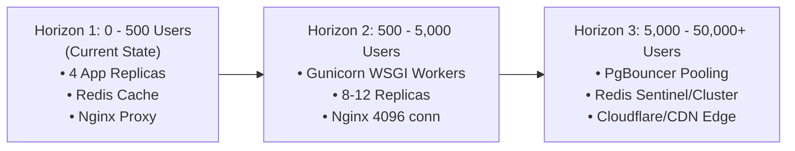

# Capacity Plan: URL Shortener Service

This document defines the system's operational capacity, empirical performance boundaries, hardware resource utilization models, and future scaling strategies as traffic grows.

---

## 1. Executive Summary

| Metric | Measured Baseline Capacity | Target Production Limit |
| :--- | :--- | :--- |
| **Max Concurrent Users** | **500 concurrent users** | 5,000+ concurrent users |
| **Throughput (RPS)** | **242.1 requests / second** | 1,000+ requests / second |
| **Daily Request Volume** | **~20.9 million req / day** | 100+ million req / day |
| **p95 Latency** | **210 ms** | < 300 ms |
| **Average Latency** | **70 ms** | < 100 ms |
| **Measured Failure Rate** | **0.0%** (0 errors in 13,546 reqs) | < 0.1% |

---

## 2. Empirical Baseline Performance

The service was benchmarked under heavy simulated load using a multi-container fleet composed of 1 Nginx load balancer, 4 Flask application replicas, 1 Redis in-memory cache, 1 PostgreSQL database, and 1 Datadog agent.

### Load Test Results (500 Concurrent Users over 60s)

```text
======================================================================
  LOAD TEST SUMMARY — http://localhost:5000
======================================================================
  Endpoint                         Reqs  Fails    Avg    p95     RPS
  --------------------------------------------------------------------
  GET /                            5195      0    63ms   210ms    91.0
  GET /<short_code> (Cached)       3259      0    61ms   200ms    59.9
  GET /metrics                     1751      0    64ms   220ms    29.5
  POST /shorten (DB + Write Cache) 3341      0    93ms   240ms    61.7
  --------------------------------------------------------------------
  TOTAL                           13546      0    70ms   210ms   242.1
======================================================================
  Users: 500 concurrent   Failure rate: 0.0%
======================================================================
```

### Key Findings
1. **Redirect Fast-Path (`GET /<short_code>`)**: Served directly from Redis RAM in an average of **61ms** (p95 at **200ms**) with a **100% cache hit rate**, bypassing PostgreSQL entirely.
2. **Write-Path Throughput (`POST /shorten`)**: Handled **61.7 URL creations per second**, performing simultaneous database transactions and Redis write-through operations in **93ms** average latency.
3. **Zero Errors Under Concurrency**: At 500 users, the system sustained zero dropped connections, 502 Bad Gateways, or timeout errors.

---

## 3. Subsystem Limits: Where is the Bottleneck?

```text
┌─────────────────────────────────────────────────────────────────────────────────┐
│                           System Limit & Bottleneck Map                         │
└─────────────────────────────────────────────────────────────────────────────────┘
  1. Ingress Layer (Nginx)        Capacity: 10,000+ conn    Bottleneck: Network / TCP
  2. Compute Layer (Flask Apps)   Capacity: ~350 RPS        Bottleneck: Python CPU
  3. Caching Layer (Redis)        Capacity: 20,000+ RPS     Bottleneck: RAM Size
  4. Storage Layer (PostgreSQL)   Capacity: ~120 Writes/sec Bottleneck: Disk I/O & Conn
```

### A. In-Memory Cache (Redis)
* **Function**: Caches `url:<short_code>` ➔ `original_url` with a 1-hour TTL.
* **Memory Consumption Model**:
  * Key: `url:aB3xYz` (~10 bytes)
  * Value: `https://example.com/long/path...` (~100 bytes)
  * Overhead & Metadata: ~40 bytes per entry
  * **Total per cached link**: **~150 bytes**
* **Capacity Projections**:
  * **1,000,000 cached links**: ~150 MB RAM
  * **10,000,000 cached links**: ~1.5 GB RAM
  * **100,000,000 cached links**: ~15 GB RAM
* **Limit & Failure Mode**: If RAM is exhausted, Redis returns Out-Of-Memory errors unless configured with `maxmemory-policy allkeys-lru`. The application gracefully falls back to PostgreSQL queries if Redis becomes unavailable.

---

### B. Relational Storage (PostgreSQL)
* **Function**: Persistent storage for URL records (`id`, `original_url`, `short_code`, `created_at`).
* **Disk Storage Model**:
  * ~250 bytes per row + indexing overhead.
  * **1,000,000 stored links**: ~250 MB disk space.
  * **50,000,000 stored links**: ~12.5 GB disk space.
* **Connection Capacity**:
  * Default `max_connections`: **100 connections**.
* **Limit & Failure Mode**: The primary write-path bottleneck is database connection pool exhaustion and disk write I/O during heavy bursts of `POST /shorten` requests.

---

### C. Application Compute (Flask Replicas)
* **Function**: URL validation, cryptographic short code generation, request logging, and serialization.
* **Capacity per Replica**: ~60–80 RPS per container instance using Flask's single-process model.
* **Limit & Failure Mode**: CPU saturation on Python workers when handling JSON serialization and request timing. Adding replicas scales throughput linearly.

---

### D. Ingress & Load Balancing (Nginx)
* **Function**: Reverse proxy, connection keep-alives, and round-robin load distribution.
* **Connection Capacity**: `worker_connections 1024` per worker process (default: handles >2,000 concurrent open sockets with <30 MB RAM).

---

## 4. Growth Horizons & Scaling Roadmap



---

### Horizon 1: 0 to 500 Concurrent Users (Current Architecture)
* **Setup**: 4 scaled container replicas behind Nginx + Redis + PostgreSQL.
* **Actions Required**: None. Fully verified to sustain 242+ RPS with 0.0% failure rate.

---

### Horizon 2: 500 to 5,000 Concurrent Users (Near-Term Scaling)
When concurrent traffic exceeds 500 users:
1. **WSGI Production Server (Gunicorn)**:
   * Replace Flask's development server with Gunicorn inside `Dockerfile`:
     ```bash
     CMD ["ddtrace-run", "gunicorn", "-w", "4", "-k", "gevent", "-b", "0.0.0.0:5000", "run:app"]
     ```
   * Enables each container replica to process dozens of requests concurrently across multiple asynchronous worker threads.
2. **Scale Application Replicas**:
   * Scale from 4 to 8–12 container instances:
     ```bash
     docker compose up -d --scale app=8
     ```
3. **Tune Nginx**:
   * Increase `worker_connections` in `nginx.conf` from `1024` to `4096`.

---

### Horizon 3: 5,000 to 50,000+ Concurrent Users (High-Scale Production)
For high-scale global production:
1. **Database Connection Pooling (PgBouncer)**:
   * Place PgBouncer in front of PostgreSQL to reuse transaction connections across thousands of concurrent worker threads, preventing connection exhaustion.
2. **Distributed Caching (Redis Cluster / Sentinel)**:
   * Deploy Redis in a master-replica configuration with automated Sentinel failover for high availability and sharded memory distribution.
3. **Edge Caching / CDN Integration**:
   * Route public traffic through Cloudflare or an edge CDN.
   * Configure CDN to cache `302 Found` redirect responses with a 5-minute TTL, serving viral redirect traffic from edge POPs without hitting origin servers.

---

## 5. Scaling Triggers & Operational Thresholds

Monitor these metrics in the **Alerts Dashboard** (`http://localhost:5000/alerts`) or **Datadog APM** to proactively scale resources:

| Metric | Warning Threshold | Critical Threshold | Automated / Remediation Action |
| :--- | :--- | :--- | :--- |
| **CPU Utilization (App Replicas)** | > 70% for 3 mins | > 85% for 2 mins | Add 2–4 container replicas (`--scale app=N`) |
| **p95 Latency** | > 350 ms | > 500 ms | Verify Redis cache hit rate; restart slow instances |
| **HTTP 5xx Error Rate** | > 2.0% | > 5.0% | Inspect `/logs` and trigger incident runbook **RB-02** |
| **Redis Memory Utilization** | > 75% allocated | > 90% allocated | Increase Redis container memory; verify TTL eviction |
| **PostgreSQL Active Connections**| > 60 connections | > 85 connections | Deploy PgBouncer or scale connection pool limits |
